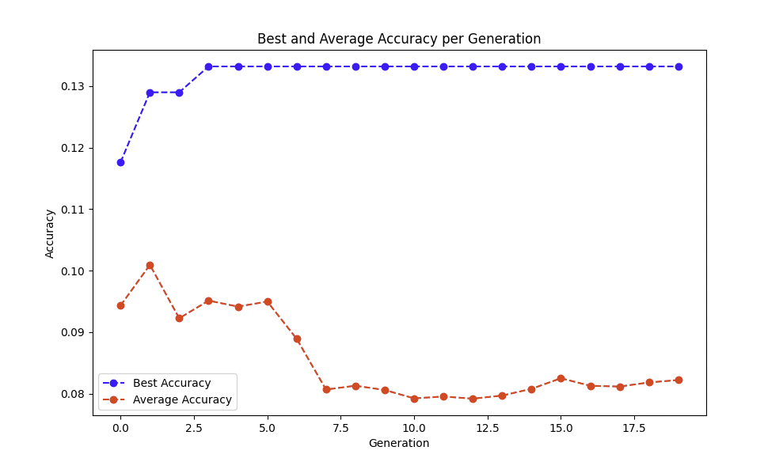
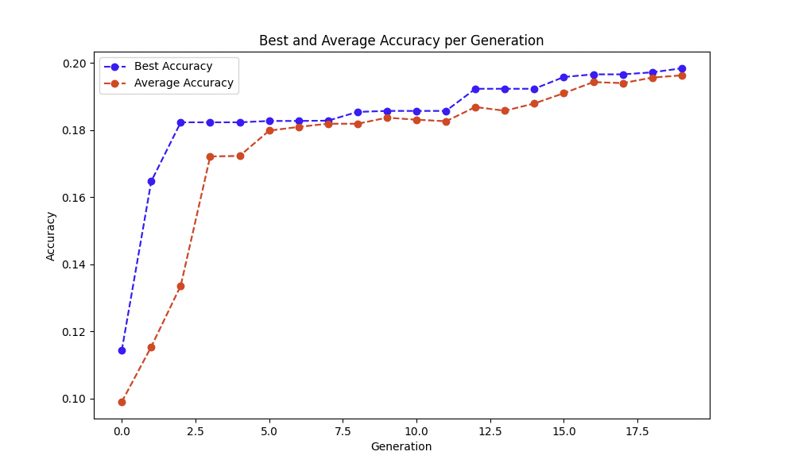
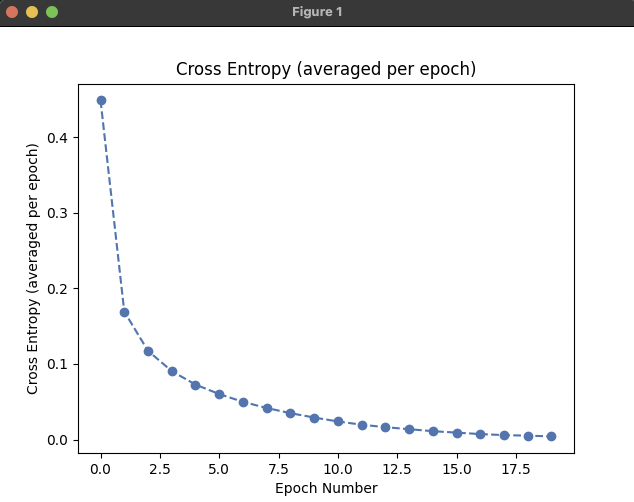
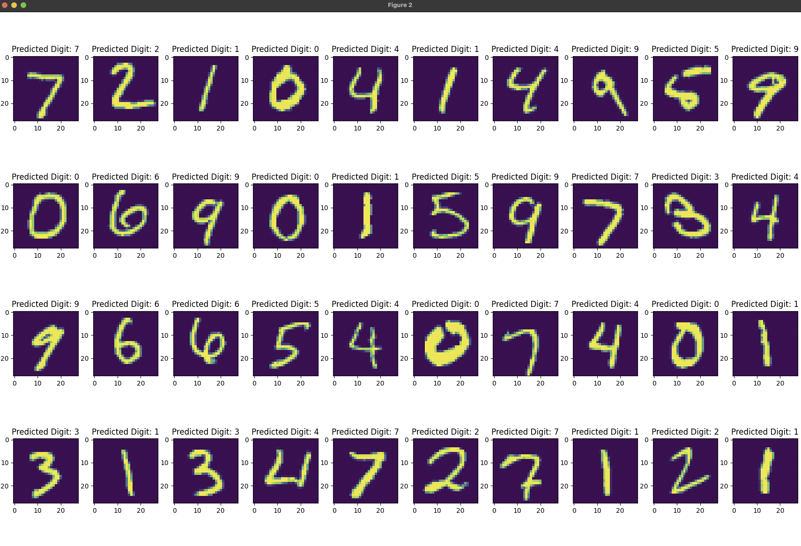
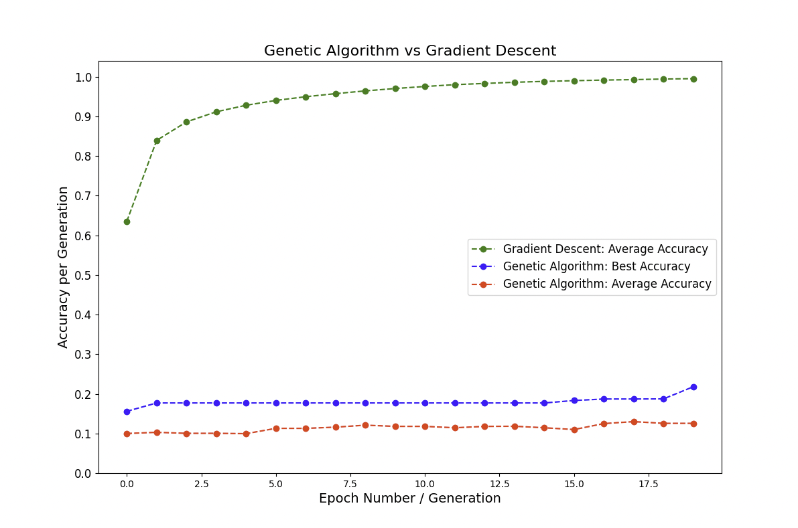

# OCR AI Methodenvergleich

Willkommen im **OCR AI Methodenvergleich** Repository, erstellt von [leopoldsprenger](https://github.com/leopoldsprenger). Dieses Projekt vergleicht zwei verschiedene Methoden der künstlichen Intelligenz für die optische Zeichenerkennung (OCR) im Rahmen eines wissenschaftlichen Projekts der 9. Klasse. Ziel ist es, zu bewerten, wie diese Methoden handschriftliche Ziffern aus dem MNIST-Datensatz erkennen.

## Projektübersicht

Dieses Repository implementiert und vergleicht zwei KI-Ansätze für OCR:

- **Genetisch Algorithmus-basierte KI**: Ein Modell, das mit genetischen Algorithmen optimiert wurde.
- **Gradientenabstieg-basierte KI**: Ein traditionelles neuronales Netzwerk, das mit dem Gradientenabstieg-Optimierer trainiert wurde.

### Inhaltsverzeichnis
1. [Installation](#installation)
2. [Verwendung](#verwendung)
3. [Erklärung der Neural Network Klasse](#neural-network-klasse-erklärung)
4. [Lizenz](#lizenz)

---

## Installation

Um mit diesem Projekt zu beginnen, klonen Sie zunächst das Repository:

```bash
git clone https://github.com/leopoldsprenger/ocr-ai-method-comparison.git
cd ocr-ai-method-comparison
```

### Voraussetzungen

Stellen Sie sicher, dass Sie **Python 3.12.6** installiert haben. Installieren Sie die erforderlichen Abhängigkeiten mit pip:

```bash
pip install -r requirements.txt
```

*Hinweis: Wenn Sie keine `requirements.txt`-Datei haben, stellen Sie bitte sicher, dass Sie PyTorch und andere Abhängigkeiten manuell installieren.*

---

## Verwendung

### Training von Modellen

Sie können entweder KI-Modell mit den folgenden Skripten trainieren:

- Um die **genetisch Algorithmus-basierte KI** zu trainieren, führen Sie aus:
  ```bash
  python genetic_algorithm.py
  ```

- Um die **Gradientenabstieg-basierte KI** zu trainieren, führen Sie aus:
  ```bash
  python gradient_descent.py
  ```

### Evaluation

Nach dem Training möchten Sie möglicherweise die Leistung der Modelle bewerten. Hier sind die Schritte:

- Zur Evaluierung des **genetisch Algorithmus-basierten Modells**, überprüfen Sie die Ergebnisse in `result_images/genetic_algorithm/`, insbesondere die Dateien:
  - 
  - 

- Zur Evaluierung des **Gradientenabstieg-basierten Modells** finden Sie die Ergebnisse in `result_images/gradient_descent/`, die visuelle Darstellungen wie enthalten:
  - 
  - 

### Visuelle Ergebnisse

Hier sind einige Bilder, die Sie überprüfen können, um die Genauigkeit beider Ansätze zu vergleichen:


---

## Erklärung der Neural Network Klasse

Die **NeuronalNetwork** Klasse ist ein entscheidendes Element beider KI-Modelle. Unten befindet sich eine vereinfachte Darstellung der Klassendefinition:

```python
import torch
import torch.nn as nn

class NeuralNetwork(nn.Module):
    def __init__(self):
        super(NeuralNetwork, self).__init__()
        self.fc1 = nn.Linear(784, 128)  # Eingabeschicht zu versteckter Schicht
        self.fc2 = nn.Linear(128, 64)   # Versteckte Schicht zu einer anderen versteckten Schicht
        self.fc3 = nn.Linear(64, 10)    # Versteckte Schicht zu Ausgabeschicht

    def forward(self, x):
        x = torch.relu(self.fc1(x))  # ReLU Aktivierungsfunktion anwenden
        x = torch.relu(self.fc2(x))  # ReLU Aktivierungsfunktion anwenden
        x = self.fc3(x)               # Ausgabeschicht
        return x
```

### Erklärung der Klassendefinition

- **Eingabeschicht**: Akzeptiert Bilder in der Größe von 28x28 Pixeln, die in einen Vektor mit 784 Eingängen umgewandelt werden.
- **Versteckte Schichten**: Enthält typischerweise eine oder mehrere versteckte Schichten mit ReLU-Aktivierungsfunktionen, um Nichtlinearität einzuführen.
- **Ausgabeschicht**: Gibt Wahrscheinlichkeiten für jede der zehn Ziffernklassen (0-9) aus.

Diese Klasse definiert, wie Daten durch das Netzwerk fließen, während des Trainings Gewichte aktualisiert werden und während der Bewertung Vorhersagen getroffen werden.

---

## Lizenz

Dieses Projekt ist unter der [MIT-Lizenz](https://opensource.org/licenses/MIT) lizenziert, die die Wiederverwendung des Codes mit angemessener Attribution erlaubt.

---

Wenn Sie weitere Modifikationen oder Fragen haben, zögern Sie nicht, sich zu melden!
